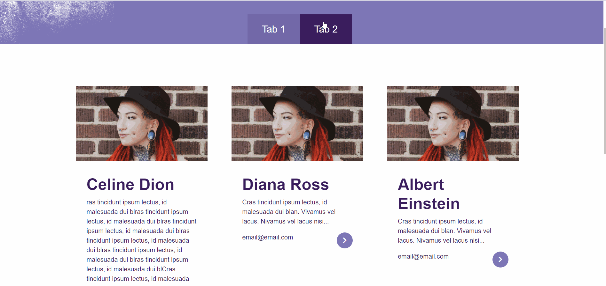

# Tabs

This lab is intended to give you further practice with creating state, accessing state, and changing state.

# Setup

1. `cd` into the provided starter code folder: `starter-code`. 
2. Install and run the code as per usual. 
3. You should see 6 cards show up in the browser, like this:

# Task:

1. Make it so that clicking on Tab 1 shows 3 cards.
2. Clicking on Tab 2 should show 3 other cards.

