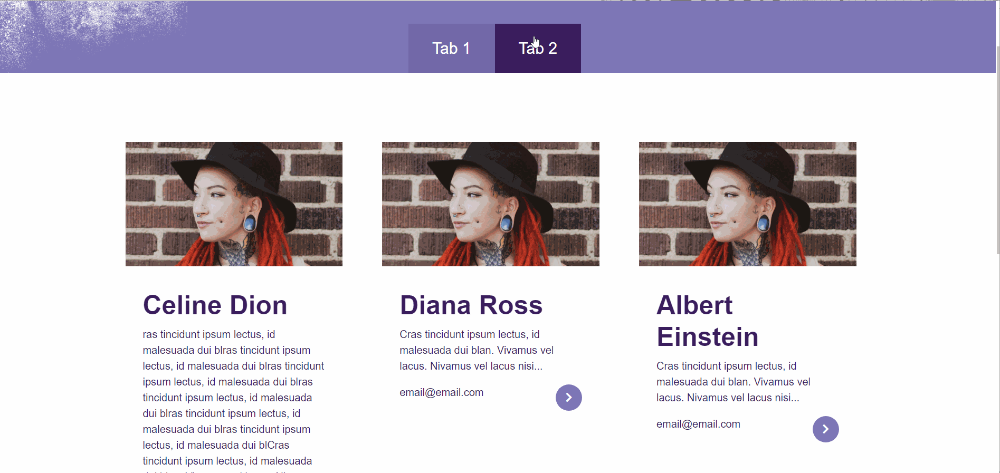

# Tabs

This lab is intended to give you further practice with creating state, accessing state, and changing state.

# Setup

1. `cd` into the provided starter code folder: `starter-code`. 
2. Install and run the code as per usual. 
3. You should see 6 cards show up in the browser, like this:

# Task:

1. Make it so that clicking on Tab 1 shows 3 cards.
2. Clicking on Tab 2 should show 3 other cards.

# Hints:

1. convert this to a class component
2. Put an initial state into App (not the cards!)
3. An example of an initial state might be, for example, currentTab: 1
4. Have the tabs be sort of like buttons with an onClick event that will trigger a state change -- ie., update the "currentTab" state.
5. In the JSX, Below the tabs, do some conditional logic to determine which section to show 

 <strong>BIGGER HINTS:</strong>
  

    <ol>
      <li>more detailed hint for step 4 above: you can add an onClick event to your tab, for example:
        <ul>
          <li>&lt;div className="our-team-btn" onClick={()=>{this.updateCurrentTabTo(1)}}&gt;Team 1&lt;/div&gt;</li>
          <li>&lt;div className="our-board-btn" onClick={()=>{this.updateCurrentTabTo(2)}}&gt;Team 2&lt;/div&gt;</li>
        </ul>
      </li>
      <li>
        more detailed  hint for step 5 above: you can use the ternary operator to conditionally show sections of the page. for example, in your JSX, you can do this:
        <ul>
          <li>{ this.state.currentTab === 1 ? <section>This is Section 1</section> : <section>Section 2</section>}</li>
        </ul>
      </li>
    </ol>
  

# Optional Task 2 (totally optional): Card Flip

1. Every card has a back, if you check out the code in Card.jsx. 
2. If you apply a class of "show" to the div with id single-article-1, it will (in theory) make the "back" of the card show up:

3. Your task is to make it so that the card flips and shows the back side when you click the `>`. 
4. On the back, there is an X. Make the card flip back to the front when the 'X' is clicked.

# Deliverable

This is a deliverable. To submit, please:

1. Push this to your fork of the class repo.
2. On your web browser, use the web interface to navigate to the location of the code you just pushed
3. Copy and paste this into your deliverables file.

