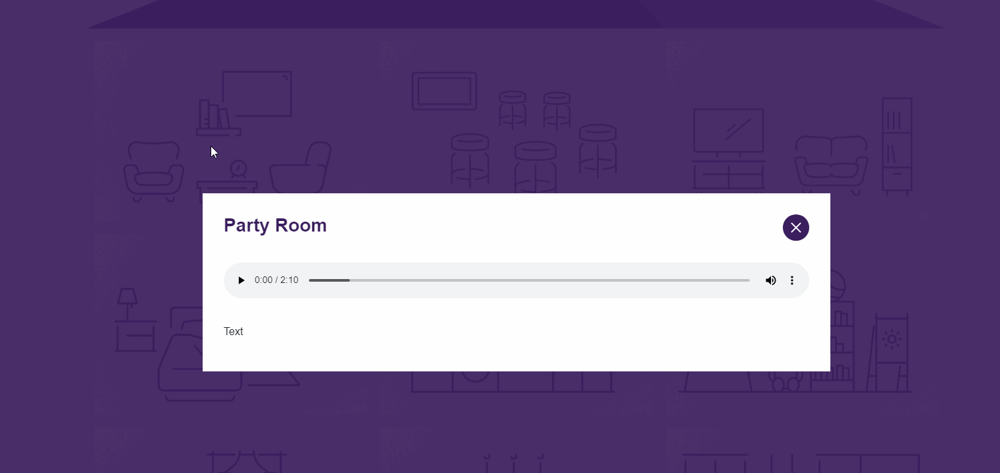
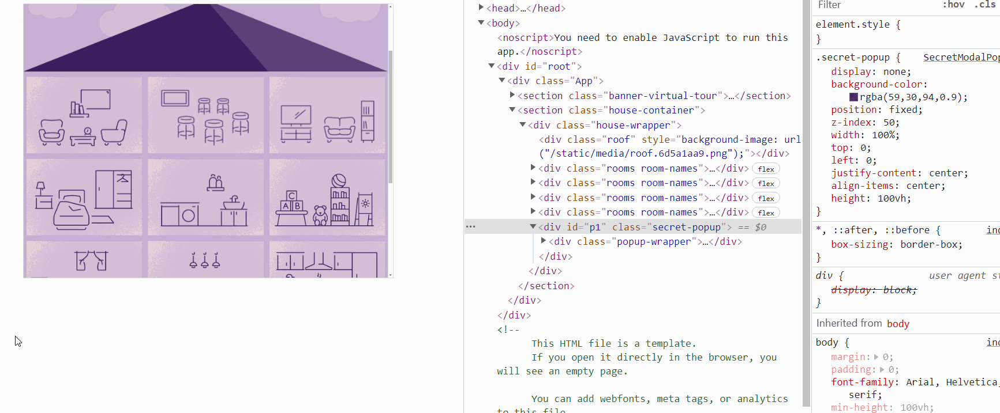

# House of Cards Lab

# Theme

As always, feel free to change the theme/images to whatever you like.

# Setup

1. Run the starter code in the `house-of-cards-lab` folder, and you should be greeted with something like this. Hovering over a room reveals a button:

# Task

1. When we click on one of the rooms, we want the SecretModalPopup to appear. It will have the room name. 
2. When we click on the 'X' on the SecretModalPopup, the secretModalPopup should disappear.
3. (optionally, you may insert a soundtrack appropriate for that room)

# Hints

Hint: 

  0. Any visual changes wil require some kind of state. So change your App from a function to a class component (click <a href="https://user-images.githubusercontent.com/24878576/126814144-dcce6012-5796-4a9c-bd03-d4330b2857ae.png">here</a> for the solution if you've forgotten how).

1. Figure out your state. Think about what is changing from moment to moment:
- sometimes the popup is there, and sometimes it's not. So, let's add "showPopup" as a state variable that can be true/false. If it's true, we can make the popup show. If it's false, we can hide the popup.

An example of initial initial state (note: you will need to add another state later to have the popup show specific rooms, but start with this for now):

2. There are three steps for state: initialize state. access state wherever it's needed. upate state. So let's see. We have a showPopup. If it's true, we want t ostyle the popup to display: flex. If it's false, we want to style the popup to display: none. So that means we need to add an inline style since the styling is dynamic.

3. And of course this `<SecretPopupModal>` component has no access to the showPopup state. How can `<SecretPopupModal>` get access to that showPopup state?   We pass it down as props.

4. And verify with the inspector that our props are making it down to where they're needed:

5. ok so the `<SecretPopup>` now has the showPopup coming in as a prop. How can we make it show up if showPopup is true, and how can we hide it if showPopup is false?

Let's fix our inline style from a few steps ago:

6. Now if the showPopup is true, it should display:flex, and if it's false, it should display:none. Test it out. Remember, baby steps. Slow and steady wins the race. Verify everything.

7. The last step of dealing with state is to update state. We want to update state to have showPopup true when the room button  is clicked. So find the room button in the `<Room>` component and put an onClick on it that will setState on showPopup

8. As we start writing our onClick it should occur to us that, "oh crap" the state known as showpopup is actually in the parent, not the child. So maybe we need to do the setState in the parent in a method, and then pass that method down to where the onClick is -- ie., each of your `<Room>` components:

9. Verify that  `<Room />` is receiving the props via the inspector - 

10. Finally, have the button onClick in the <Room /> component call this method. -- you can do this one yourself!

11. the popup should now open when you click.

12. Your next steps: Figure out how to make the 'x' in `<SecretPopupModal>` actually set the state of showPopup to false.
13. Pass in the room name of the currently active/clicked room to the `<SecretPopupModal>` (this is going to involve quite a few steps)

